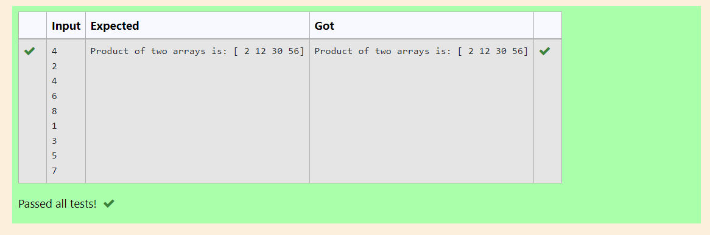

# Multiplying-two-matrix

## AIM:
To write python programing using  Multiplying-two-matrix

## ALGORITHM:
### Step 1:
Get the input from the user

### Step 2:
use append() to add new elements in the list

### Step 3:
Get the input from the user using np.array()

### Step 4:
result = value1*value2 it will multiply the array and print the output

### Step 5:
End the program

## PROGRAM: 
```
#Developed by: Kiran J
#Reg no.: 21500363
import numpy as np
l1,l2 = [],[]
n = int(input())
for i in range(n):
    l1.append(int(input()))
for i in range(n):
    l2.append(int(input()))
value1=np.array(l1)
value2=np.array(l2)
result=value1*value2

print("Product of two arrays is:",result
```

## OUTPUT:


## RESULT:
Thus the program is written to Multiplying two matrix


